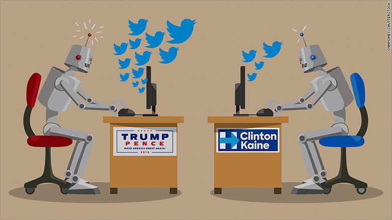

# Kelsey Landon and Ramiro Ochoa
# Group #14

### Motivation
Bots can be used positively, to automate help and news services; however, they can also be used negatively, to spread misinformation. Your personal opinion of bots is probably derived from experience or anecdotal evidence. Going into this project, we tried to remain unbiased by our personal assumptions of how bots are being used in the fast-paced world of social networks. We were curious if we could deduce goals or intentions and determine how effective a bot currently is at working toward that goal.

### Project Statement
 
With an average of 6,000 tweets per second, Twitter produces vast amounts of social data. We do not know how much of that data is being created or distributed by bots. 
 
Goal: To determine the influence of bots in trending topics. We will attempt to deduce what topics bots are focused on, and whether the sentiment of those bot posts is primarily positive or negative. To judge strength of bot influence within a topic, we will examine the number of followers and the number of retweets (of the bot tweets), as well as the geographic diversity of both.

