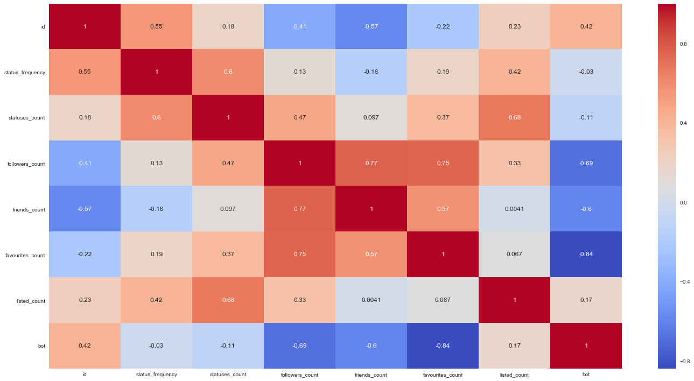
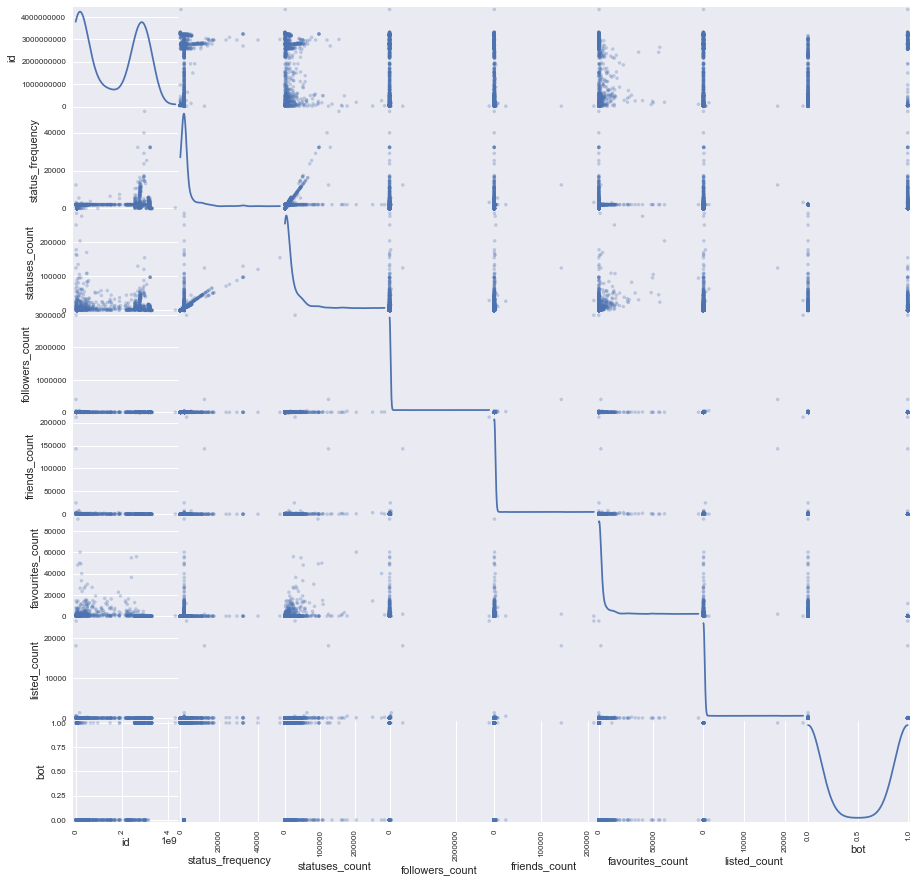
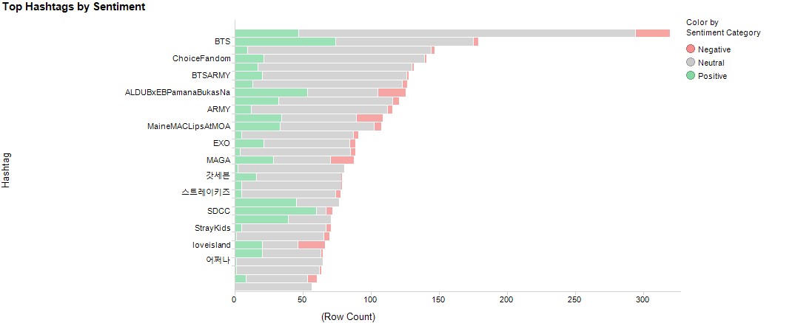
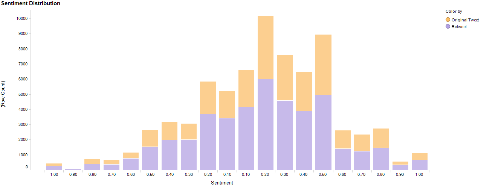
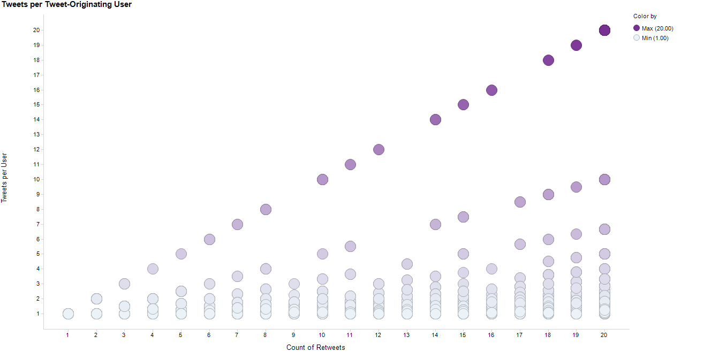
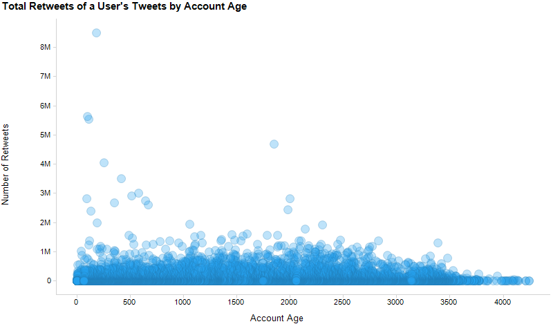
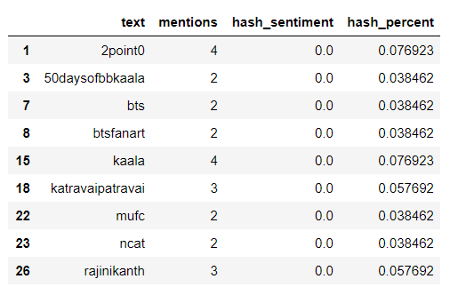
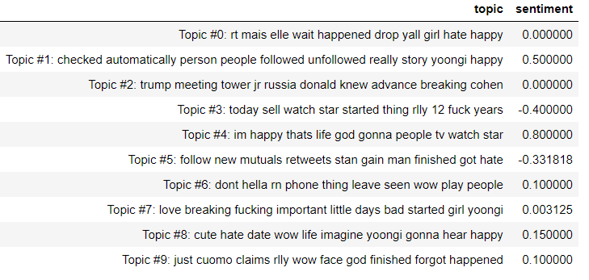
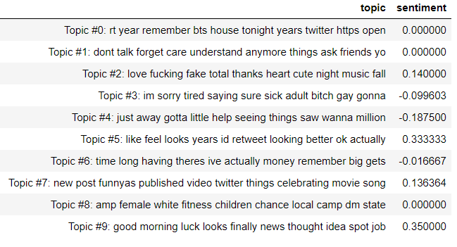

## 1. Introduction and Description of Data

We used the search function of the Twitter API to create a comprehensive dataset of tweet samplings, which we save to a PostgreSQL database. 

We took our sampling of tweets and compiled the most recent 20 tweets for all users. Having more data from each user allowed us to initially have better analytics for user-specific behavior (e.g., what percent of a user’s tweets are retweets). That data set ended up being quite large, so we chose the tweets of 1,000 users for our data set.

We then retrieved a botornot score from the botometer api for our 1,000 users.

### 1) Description of Raw Data

This data is one row per tweet, though objects such as users, retweets, and quote tweets are nested within a tweet as a dictionary. This is the biggest challenge of this data. It is naturally nested in structure, since a tweet has many objects, and can originate from a retweet, which also has many objects. Most of the data preparation time was spent flattening out the data. 

We also cleaned the tweets for special characters in order to create a good sentiment analysis.

A heatmap was produced from our dataframe variables showing spearman correlations between known bot and non bot samples.  Many strong correlations were found. This can especially be seen between favorites_count and follower_count. Other predictors also have very strong negative correlations with the exception of listed_count. 


[Link](images/heatmap.png)

### 2) Initial Data Analysis

#### Tweets
We analyzed tweet and retweet quantity, frequency and timing. We looked the status count for a user on a per day basis (based on the age of the account in days). Most users were between 0 and 200, but there were some obvious outliers, with one extreme user who had 1200 per day.

We also examined tweets per minute, which we think will be an especially good predictor of bots. Approximately 4% of users had a tweet rate greater than 1 per minute. We briefly looked at the interval between tweets by checking if the time between tweets was on a whole minute. It looked like approximately 1.5% of the users had odd, whole minute timing between tweets.

A scatter matrix was used to view the data for collinearity. 


[Link](images/scatter_matrix.png)


#### Hashtags
We analyzed hashtag topics and topic diversity. Below is a chart showing our top hashtags by sentiment. We see that overall the top hashtags have more positive tweets than negative. We did not find any abnormalities regarding number of hashtags per tweet; there were at max 10, sloping down to 4 or less pretty quickly, and the average was 1.36.





#### Text Content
In our data approximately 26% of tweets contained links, and of those tweets, 74% contained pictures. Tweets that contained links were predominantly retweets.

For the data overall, 52% of tweets were neutral, 33% were positive, and 15% were negative. Below is a distribution of sentiments across our data set, colored by whether the tweet was an original tweet or a retweet.





####  Tweet Networks

It was easy to determine the tweet origin, since the original tweet information is stored with every tweet. However, this did not allow us to trace a tweet back through multiple users. We were able to look at tweet duration by sentiment, but there was no significant correlation. 

#### Location

Standardized location data was generally sparse. A user has location on their profile, but it is free-form text entry. Each tweet can be at a "place", but most tweets have no location data. Only 4% of bot tweets and 10% of bot users had location-type data. For humans it was 2.3% of tweets and 7.2% of users. This negated our ability to use location to judge impact of bot tweets.


### 3) Additional Feature Engineering

For many elements, we created binary columns to aid our analysis. These include “Has Link”, "Has Hashtag", “Is Retweet”, "Is Quote Tweet", and "Has JPEG". We also add the percent of total calculations for each of these (e.g., "Retweet Percent" is the count of retweets over all tweets).

In addition, we converted all created dates to date types in order to accommodate duration logic. With these dates we created an "Account Age" column, and also a "Tweet Life Days" column, which is the duration between the create of the original tweet (the retweet object's created date) and the current tweet.

We branched out and tried some calculations that appeared interesting in our preliminary EDA. First, the count of retweets a user has divided by the number of distinct users that user is retweeting. In our preliminary EDA, we found that in general, the more a user retweets, the more distinct users those tweets originate from. These expected points are represented by the lighter dots where the retweet-to-original-user ratio is near one. However, some accounts stand out because they only ever retweet from one original account, even as their number of retweets increase. This is shown by the y=x line of darker points. This line is clearly diverging from the rest of the data.





We looked at tweets by account age, which generally increased positively together as you’d expect. When we looked at the same chart by the total number of retweets a user has of its tweets, we saw some outliers stand out. Therefore, we added a feature defined as: a users' tweets' total retweets divided by account age (in days). This can be seen on the chart below, in which each dot represents a user. You can see one user whose account is less than 500 days old, but has had his/her tweets retweeted over 8 million times.




### 4) Further Data Manipulation 

#### Hashtag Transformation

Hashtags were a problem because they are at a lower grain than even the tweet data. We needed a way to summarize hashtag activity by users. The hashtag object came in as many columns, which we unpivoted (using melt) down to a single column. First by user id, and then second by just the hashtag itself. In doing this we were able to get a hashtag count, the hashtag sentiment, and a hashtag percent popularity (hashtag count divided by count of all hashtags) on a per-user basis. By averaging these in our design matrix, we inherently  created a weighted average hashtag metrics that express how often a user is using hashtags and how popular the hashtags s/he is using are.

```python

    hashtags['hashtag_count'] = hashtags.count(axis=1)
    
    #melt by userid to unpivot the many hashtag columns
    hashtags_melt = pd.melt(hashtags.iloc[:, hashtags.columns != 'hashtag_count'], 
                        id_vars = 'user_id',var_name='hashtag_num', value_name='hashtag')
    hashtags_melt = hashtags_melt[hashtags_melt['hashtag'].notnull()]
    
    #clean text 
    hashtags_melt['text'] = hashtags_melt['hashtag'].apply(pd.Series)
                                                    ['text'].str.strip().str.lower()
    
    #group by each individual hashtag, count, and rename count column
    hashtags_count = hashtags_melt.groupby('text').agg({'text': 'count'}, as_index=False)
    hashtags_count.columns = ['mentions']
    
    #reset the index
    hashtags_count.reset_index(level=0, inplace=True, drop=False)
    
    #add hashtag sentiment
    hashtags_count['hash_sentiment'] = [TextBlob(str(row)).sentiment
                    .polarity for row in hashtags_count['text']]
    
    #calculate hashtag's use as percent of total
    hashtags_count['hash_percent'] = hashtags_count['mentions'] / 
                                hashtags_count['mentions'].sum()
    
    #join per hashtag data back to per user data
    hashtags_melt = hashtags_melt.merge(hashtags_count, left_on='text', 
                                    right_on='text', how='inner')
    
    #aggregate all hashtags for a user, average will result 
    #in a weighted average of hashtag stats
    user_hash_sum = hashtags_melt.groupby('user_id').agg({'mentions': np.mean, 
                          'hash_sentiment': np.mean,'hash_percent': np.mean})
```

Below is a list of the hashtags most used by bots:





#### Topic Modeling

Using the code below we attempted to model topics for both bots and humans.

```python
def getmatrix(documents: pd.Series):
    '''vectorizes documents via NMF and LDA and returns 
    the model and feature names for each'''
    
    no_features = 1000
    
    #NMF
    tfidf_vectorizer = TfidfVectorizer(max_df=0.95, min_df=2, 
        max_features=no_features, stop_words='english')
    tfidf = tfidf_vectorizer.fit_transform(documents)
    tfidf_feature_names = tfidf_vectorizer.get_feature_names()

    #LDA
    tf_vectorizer = CountVectorizer(max_df=0.95, min_df=2, 
        max_features=no_features, stop_words='english')
    tf = tf_vectorizer.fit_transform(documents)
    tf_feature_names = tf_vectorizer.get_feature_names()
    
    return tfidf, tfidf_feature_names, tf, tf_feature_names
    
no_topics = 50

tfidf_known, tfidf_feature_names_known, tf_known, 
    tf_feature_names_known = getmatrix(documents_known)

#NMF
nmf = NMF(n_components=no_topics, random_state=1, alpha=.1, 
          l1_ratio=.5, init='nndsvd').fit(tfidf_known)

#LDA
lda = LatentDirichletAllocation(n_topics=no_topics, max_iter=5, 
      learning_method='online', learning_offset=50.,random_state=0).fit(tf_known)
```
Below are some sample of the topics
##### Bot Topics


##### Human Topics


Unfortunately, these don't immediately help us analyze the data. In order to do that we would need to relate these topics to a type of master dictionary in hopes of deducing an overall high-level topic, for example "politics" or "dating" would be good high-level topics.


### 5) Standardization

We did standardize the data, but we found it made little difference in our models. Models such as Random Forest are very robust and do not need data to be standardized. Our random forest scores showed to be on very close to our other models.  
