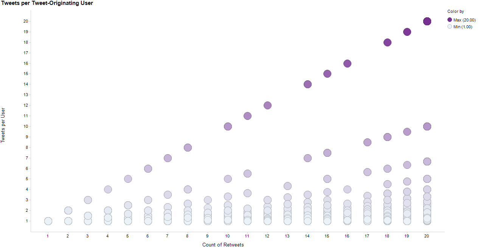
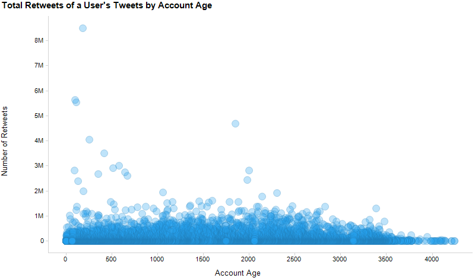

## 1. Introduction and Description of Data

We used the search function of the Twitter API to create a comprehensive dataset of tweet samplings, which we save to a PostgreSQL database. 

We took our sampling of tweets and compiled the most recent 20 tweets for all users. Having more data from each user allowed us to initally have better analytics for user-specific behavior (e.g., what percent of a user’s tweets are retweets). That data set ended up being quite large, so we chose the tweets of 1,000 users for our data set.

We then retrieved a botornot score from the botometer api for our 1,000 users.


[Link](images/heatmap.png)

**Bold**
_Italic_ 
`Code` text
```markdown
Syntax highlighted code block

```

### 1) Description of Raw Data

This data is one row per tweet, though objects such as users, retweets, and quote tweets are nested within a tweet as a dictionary. This is the biggest challenge of this data. It is naturally nested in structure, since a tweet has many objects, and can originate from a retweet, which also has many objects. Most of the data preparation time was spent flattening out the data. 

We also cleaned the tweets for special characters in order to create a good sentiment analysis.

### 2) Additional Feature Engineering

For many elements, we created binary columns to aid our analysis. These include “Has Link”, "Has Hashtag", “Is Retweet”, "Is Quote Tweet", and "Has JPEG". We also add the percent of total calculations for each of these (e.g., "Retweet Percent" is the count of retweets over all tweets).

In addition, we converted all created dates to date types in order to accommodate duration logic. With these date we create an "Account Age" column, and also a "Tweet Life Days" column, which is the duration between the create of the orignal tweet (the retweet object's created date) and the current tweet.

### 3) Further Data Manipulation 

We branched out and tried some calculations that appeared interesting in our preliminary EDA. First, the count of retweets a user has divided by the number of distinct users that user is retweeting. In our preliminary EDA, we found that in general, the more a user retweets, the more distinct users those tweets originate from. These expected points are represented by the lighter dots where the retweet-to-original-user ratio is near one. However, some accounts stand out because they only ever retweet from one original account, even as their number of retweets increase. This is shown by the y=x line of darker points. This line is clearly diverging from the rest of the data.



We looked at tweets by account age, which generally increased positively together as you’d expect. When we looked at the same chart by the total number of retweets a user has of its tweets, we saw some outliers stand out. Therefore we added a feature defined as: a users' tweets' total retweets divided by account age (in days). This can be seen on the chart below, in which each dot represents a user. You can see one user whose account is less that 500 days old, but has had his/her tweets retweeted over 8 million times.



### 4) Standardization

We did standardize the data, but we found it made little difference in our models.
