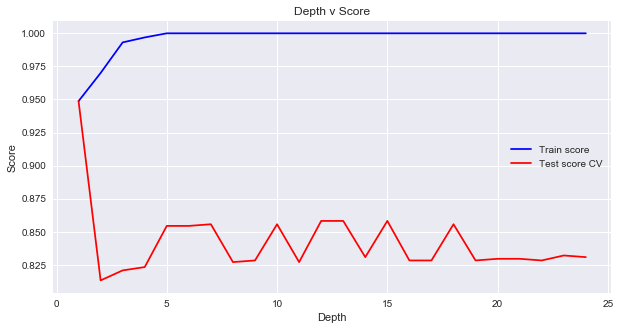
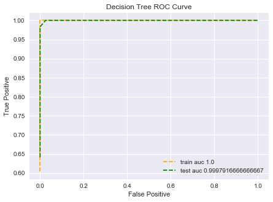

**Model Preparation and Fitting**

## Model Descriptions

Both sentiment anlysis and classification systems were modeled in our study. Twitter data, known bot data, and botometer scores were gathered for analysis. Random Forest, Logistic Regression, AdBoost, and Ensemble models were used in comparison to one another. Training and test scores were plotted and compared for accuracy and overfitting. 

## Data Preparation
### Reading and Cleaning Data

#### Cleaning Tweets
For our sentiment analysis model, first we removed special characters and line returns from our tweets.

```python
#clean tweet
df['cleantweet'] = df['text'].copy()
df['cleantweet'] = df['cleantweet'].replace(r'\n',' ', regex=True)
df['cleantweet'].replace(to_replace=r"(@[A-Za-z0-9]+)|([^0-9A-Za-z \t])|(\w+:\/\/\S+)", 
    value='',inplace=True,regex=True)
```

Undesired classification type columns such as names and text were removed from the classification set. 

```python
def mod_slick_df(df):
    # customize table to remove undesirable columns
    columns = list(df)
    df = df[[
     'id',
     'status_frequency',
     'statuses_count',
     'followers_count',
     'friends_count',
     'favourites_count',
     'listed_count',
     'bot',   
        ]].copy()

    return df

```


Then we add a sentiment score for each tweet.

```python
#add sentiment
df['sentiment'] = [TextBlob(str(row)).sentiment.polarity for row in df['cleantweet']]
```

Most significantly, we had to un-nest any sub-ojects we wanted for a tweet. Each tweet contained a json object with all attributes of the user, retweet, and quote tweet. Each retweet and quote tweet also had user objects. Each tweet (original, retweet, or quote tweet) had entities (which breaks out in hashtags, urls, media), places, and coordinates. We found the places and coordinates to be predominately empty.

```python
#break out nested objects
users = data['user'].apply(pd.Series)

retweets = data['retweeted_status'].apply(pd.Series)
retweet_users = retweets['user'].apply(pd.Series)

quotes = data['quoted_status'].apply(pd.Series)
quote_users = retweets['user'].apply(pd.Series)

entities = data['entities'].apply(pd.Series)
hashtags = entities['hashtags'].apply(pd.Series)
urls = entities['urls'].apply(pd.Series)

place = data['place'].apply(pd.Series)
coordinates = data['coordinates'].apply(pd.Series)

```


### PCA Analysis

We reviewd our data using PCA analysis with two dimensions. These first two dimensions explain 47.1% of the variance in our data. There are interesting sections, but the bots and humans are competely inter-mixed.


 
 
### Baseline
Based on the users we gathered, 2.3% were bots. Our models could guess human 100% of the time and still be 97.7% correct.

## Models

Our models will attempt to overcome the problem of our baseline--this data contains very rare successes.

### 1) Logistic Regression

We tried this model three different ways, with our orginal design matrix, with a standarized design matrix, and with a biased data set to try to offset the rare-success problem, but it never improved.

```python
kfold = KFold(5, random_state=42, shuffle=True)
Cs = [.0001, .001, .01, .1, 1, 10, 100, 1000, 10000]

log_model = LogisticRegressionCV(Cs=Cs, cv=kfold, penalty='l2').fit(X_train, y_train)
```

Logistic Model Train Accuracy: 0.958
Logistic Model Tune Accuracy: 0.965



### 2) Random Forest

The random forest model worked equally as well as the logistic regression. Thus far it seems like these models are for all intents and purposes, always guessing human.

```python
parameters = {'max_depth': range(2,6), 'n_estimators': range(1,15)}
RF_model = GridSearchCV(RandomForestClassifier(), 
                param_grid=parameters, cv=kfold).fit(X_train, y_train)

print("Best Parameters = {0}".format(RF_model.best_params_))
```
Random Forest Model Train Accuracy: 0.958
Random Forest Model Tune Accuracy: 0.965

We took a look at what parameters the model was deeming as important. Followers and favorites type fields were expected. It was interesting that account age was so important. Most surprisingly, this chart brought "contributers_enabled" to our attention. The twitter api documentation defines this as: "Indicates that the user has an account with “contributor mode” enabled, allowing for Tweets issued by the user to be co-authored by another account. Rarely true (this is a legacy field)."


### 3) Ada Boost

Ada Boost performed better than the previous two models, but based on the baseline we are working with, it does not seem good enough.

```python
parameters = {'learning_rate': [.05,.07,.85]}
boost_model = GridSearchCV(AdaBoostClassifier(base_estimator=
    DecisionTreeClassifier(max_depth=3), n_estimators=100),param_grid = 
    parameters, cv=kfold).fit(X_train, y_train)
```
Boost Model Train Accuracy: 0.992
Boost Model Tune Accuracy: 0.971

We analyzed our number of iterations with the chart below, in which you can see that the test score increases until around 25 iteration, but then flattens out. We ended up maxing out the score on the tuning set at 89 iterations.




### 4) Ensemble

We then tried to combine the three methods above, but the end result for accuracy on the test set showed this method to be less than ideal. Its testing score was worse than the tuning scores of the three prevoius models.

```python
all_models_tune = pd.concat([pd.DataFrame(log_model.predict_proba(X_tune_norm)[:,1]),
                    pd.DataFrame(RF_model.predict_proba(X_tune)[:,1]),
                    pd.DataFrame(boost_model.predict_proba(X_tune)[:,1])],axis=1)
all_models_test = pd.concat([pd.DataFrame(log_model.predict_proba(X_test_norm)[:,1]),
                    pd.DataFrame(RF_model.predict_proba(X_test)[:,1]),
                    pd.DataFrame(boost_model.predict_proba(X_test)[:,1])],axis=1)

ens_log_model = LogisticRegressionCV(Cs=Cs, cv=kfold, penalty='l2').fit(all_models_tune,y_tune)
```
Ensemble Logisitic Model Accuracy: 0.9649
Ensemble Logisitic Model Test Accuracy: 0.9598
