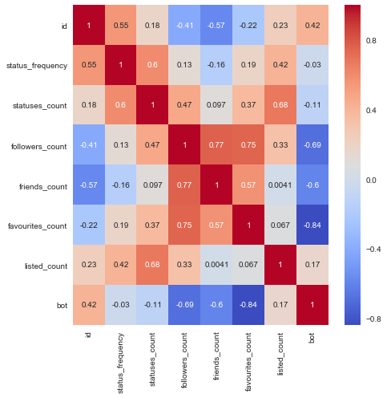

---
layout:page
title: Results and Conclusion
---

## 1. Summary

For the bots in our data set, we found average sentiment for the bot topics was -.002, whereas humans averaged .099. Is this difference actually statistically significant? Probably not. The standard deviations are approx .26, .3 respectively. 

## 2. Results

The precision in our models proved to be very effective in finding twitter bots. A scatter matrix was used to view the data for collinearity to reduce over fitting our data. ROC scores and cross validation scores also showed that our test data and out training data were very close and showed little signs of overfitting the data. 

Strong correlations were found in the data. So strogly correlated that our precsion and accuracy were phenomenal. 

Cross valiation and scatter plots would suggest that overfitting and collinearity were minimal. 

## 3. Conclusion & Future Work

In this work, we were able to very precisely detect bots. However, work in ensuring recall is equally accurate would be beneficial. 
